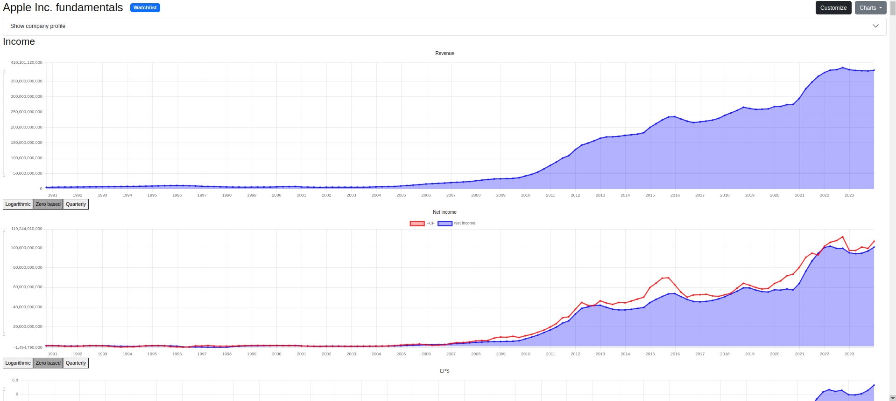

## Financial data application

Used to visualize financial fundamental data, as well as it contains many other utilities to screen and backtest investment strategies.

### Usage

First you need to download the fundamental data. You only need to do this once (and every once in a while to update the data):

 - You need a license to https://site.financialmodelingprep.com/developer/docs/ to download the financial fundamental data (currently cheapest is $19/month).
 - You also need a free API key to https://apilayer.com/marketplace/currency_data-api
 - Run com.helospark.financialdata.util.StockDataDownloader as Java application, and give `-DAPI_KEY=FINANCIALMODLINGPREP_API_KEY -DAPI_LAYER_API_KEY=APILAYER_API_KEY`` as VM arguments
    - You may want to filter what to download by commenting out unnecessary symbols. By default it downloads all known stocks (about 40 000 stocks, ~20GB).

Once you have the data, run `com.helospark.financialdata.FinancialDataApplication` as Java application. You will then be able to reach the UI on http://localhost:8080/stock/INTC

You can change the stock ticket in the URI to see different stocks.

### Utils

There are utils under `com.helospark.financialdata.util`, these are separate applications.

 - StockDataDownload - Downloads data from financialmodelingprep
 - CompanyScreener - Find stocks with certain properties or does backtest. You can find multiple implementations under analyzer package.
 
 
### Dev notes

**Generate new JWT signing keys**

    openssl genrsa -out jwt2.pem 2048
    openssl rsa -in jwt2.pem -pubout > jwt2.pub

**Generate new DKIM keys**

    openssl genrsa -out dkim_private.pem 2048
    openssl pkcs8 -topk8 -inform PEM -outform DER -nocrypt -in dkim_private.pem -out dkim_private.der

Copy the above private key to src/main/resources/dkim folder.
Then get the public key and copy it as DNS TXT record with `email._domainkey` subdomain (`email` is the selector):

    openssl rsa -in dkim_private.pem -pubout -outform der 2>/dev/null | openssl base64 -A

**Create SPF1 and DMARC**

Create TXT records in your DNS for root sender domain:

    v=spf1 ip4={SENDER_IP} ~all

Create dmarc record with sub-domain `_dmarc`:

    v=DMARC1; p=quarantine; rua=mailto:support@longtermstockfundamentals.com